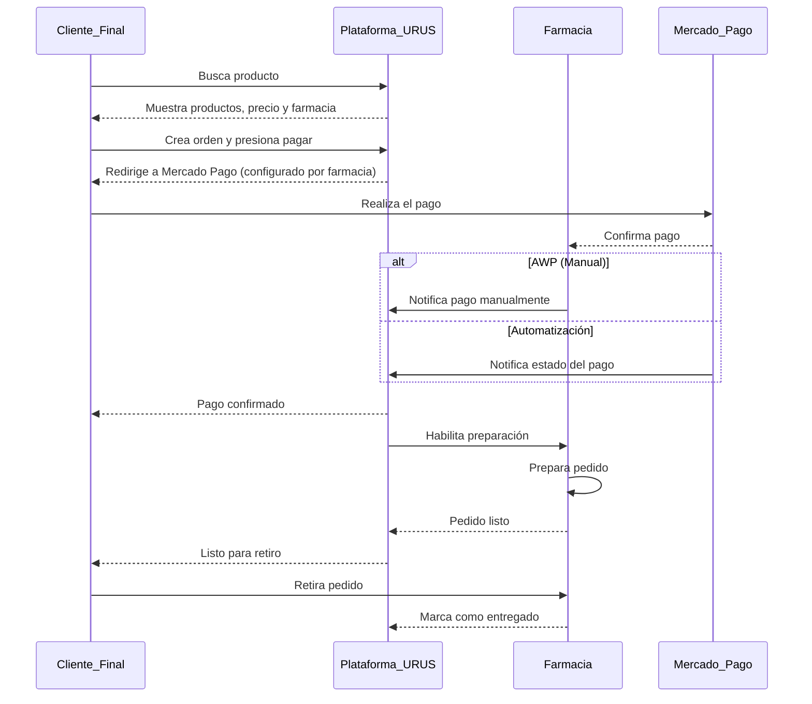

```mermaid
sequenceDiagram
    participant Cliente_Final
    participant Plataforma_URUS
    participant Farmacia
    participant Mercado_Pago

    Cliente_Final->>Plataforma_URUS: Busca producto
    Plataforma_URUS-->>Cliente_Final: Muestra productos, precio y farmacia
    Cliente_Final->>Plataforma_URUS: Crea orden y presiona pagar
    Plataforma_URUS-->>Cliente_Final: Redirige a Mercado Pago (configurado por farmacia)
    Cliente_Final->>Mercado_Pago: Realiza el pago
    Mercado_Pago-->>Farmacia: Confirma pago

    alt AWP (Manual)
        Farmacia->>Plataforma_URUS: Notifica pago manualmente
    else Automatización
        Mercado_Pago->>Plataforma_URUS: Notifica estado del pago
    end

    Plataforma_URUS-->>Cliente_Final: Pago confirmado
    Plataforma_URUS->>Farmacia: Habilita preparación
    Farmacia->>Farmacia: Prepara pedido
    Farmacia-->>Plataforma_URUS: Pedido listo
    Plataforma_URUS-->>Cliente_Final: Listo para retiro
    Cliente_Final->>Farmacia: Retira pedido
    Farmacia-->>Plataforma_URUS: Marca como entregado

```